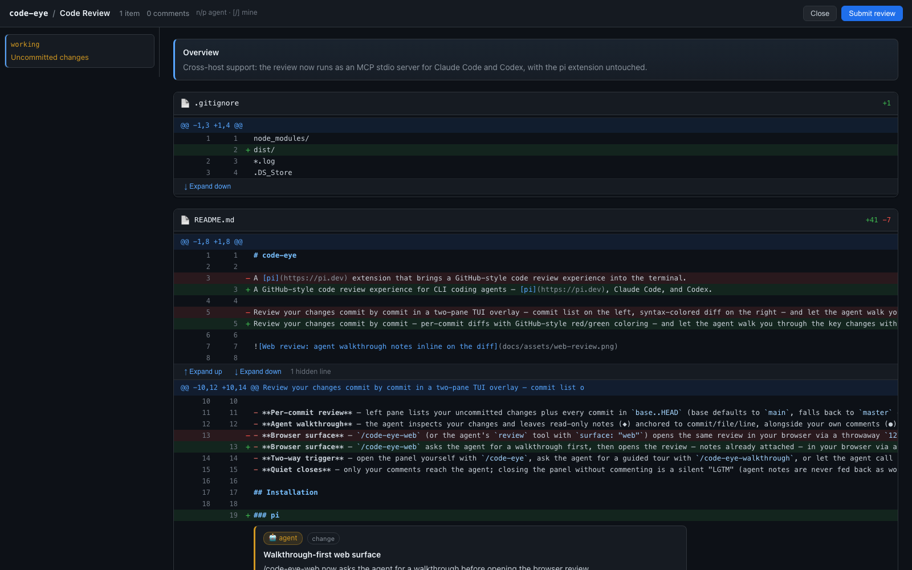
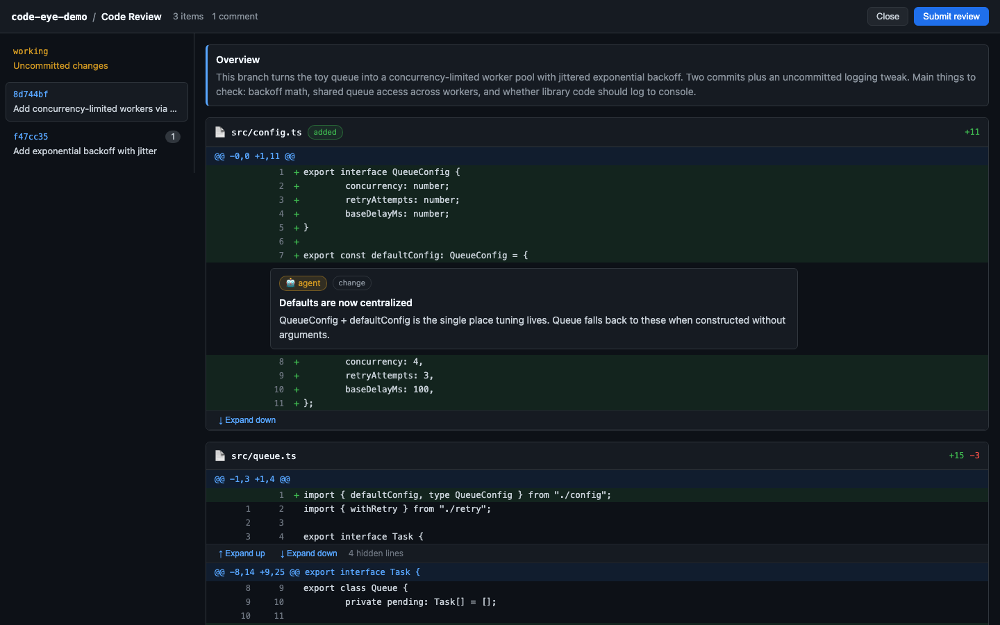

# code-eye

A GitHub-style code review experience for CLI coding agents — [pi](https://pi.dev), Claude Code, and Codex.

Review your changes commit by commit — per-commit diffs with GitHub-style red/green coloring — and let the agent walk you through the key changes with context, right where they happen. On pi the review runs in a two-pane TUI overlay; everywhere it can also run in your browser. Prefer the browser? `/code-eye-web` (pi) or the bundled review skills (Claude Code / Codex) open the same review in a local web UI:



## Features

- **Per-commit review** — left pane lists your uncommitted changes plus every commit in `base..HEAD` (base defaults to `main`, falls back to `master` or the origin default branch); the right pane shows the selected commit's diff with GitHub-style red/green coloring and line numbers.
- **Agent walkthrough** — the agent inspects your changes and leaves read-only notes (◆) anchored to commit/file/line, alongside your own comments (●). Jump between notes with `n`/`p`.
- **Browser surface** — `/code-eye-web` asks the agent for a walkthrough first, then opens the review — notes already attached — in your browser via a throwaway `127.0.0.1` server: real scrolling, multi-line comment editing, GitHub-like chrome. It shuts down when you submit or close.
- **Two-way trigger** — open the panel yourself with `/code-eye`, ask the agent for a guided tour with `/code-eye-walkthrough`, or let the agent call its `review` tool after making changes ("walk me through what you changed").
- **Quiet closes** — only your comments reach the agent; closing the panel without commenting is a silent "LGTM" (agent notes are never fed back as work items).

## Installation

### pi

```bash
pi install npm:@toddzheng024/code-eye
```

Or from the git repo:

```bash
pi install git:github.com/qiz029/code-eye
```

Or add it to `~/.pi/agent/settings.json`:

```json
{
	"packages": ["npm:@toddzheng024/code-eye"]
}
```

To try it without installing:

```bash
pi -e git:github.com/qiz029/code-eye
```

Reload a running pi session with `/reload`.

### Claude Code

This repo is a plugin marketplace:

```
/plugin marketplace add qiz029/code-eye
/plugin install code-eye@code-eye
```

The plugin bundles an MCP server (`code-eye-mcp`, run via `npx`) and two skills: walkthrough (default) and plain review. Reviews can stay open as long as you like — the server sends progress heartbeats — but if you want to be safe against idle timeouts, set `CLAUDE_CODE_MCP_TOOL_IDLE_TIMEOUT=0`; and if you don't want long review calls auto-backgrounded after 2 minutes, set `CLAUDE_CODE_MCP_AUTO_BACKGROUND_MS=0`.

### Codex

This repo is a plugin marketplace:

```
codex plugin marketplace add qiz029/code-eye
```

then install via `/plugins`. The plugin bundles an MCP server and a `code-eye` skill (`$code-eye`, or just ask to "walk me through the changes"). One required config tweak in `~/.codex/config.toml` — the default 60s MCP tool timeout would kill an open review:

```toml
[mcp_servers.code-eye]
tool_timeout_sec = 3600
default_tools_approval_mode = "auto"
```

On both hosts the review runs in your browser (their TUIs have no custom component API — see `docs/adr/0004-cross-host-mcp-server.md`).

## Usage

| Command | Description |
|---|---|
| `/code-eye` | Open the review panel (TUI) |
| `/code-eye-web` | Ask the agent for a walkthrough, then open the review panel in the browser with it |
| `/code-eye-walkthrough` | Ask the agent to generate a walkthrough and open the panel with it |

Inside the panel:

| Key | Action |
|---|---|
| `↑`/`↓` | Select commit (left pane) / scroll diff (right pane) |
| `Tab` / `Enter` / `←` | Switch between panes |
| `PgUp`/`PgDn` | Page through the diff |
| `n` / `p` | Next / previous agent note (when a walkthrough is active) |
| `c` / `Enter` | Add or edit a comment on the current diff line (add/del/context only) |
| `d` | Delete your comment on the current line (agent notes are read-only) |
| `[` / `]` | Jump to previous / next comment |
| `w` | Ask the agent for a walkthrough (when none is active) |
| `Esc` | Close the panel (and submit any comments) |

**Line comments.** Move to a changed line, press `c` (or `Enter` on a commentable line), type your note, and press `Enter` to save. Lines with your comments are marked `●`, agent walkthrough notes are marked `◆` and peek under the cursor. Your comments stay in the session if you reopen the panel; agent notes are regenerated each time.

When you close the panel:
- If you left no comments, nothing is sent anywhere — a silent "LGTM".
- If the agent opened it via the `review` tool, your comments come back in the tool result for the agent to address.
- If you opened it with `/code-eye`, your comments are sent to the agent as a follow-up message.

The agent can also open the panel itself via the `review` tool, optionally passing a summary, walkthrough stops, and `surface: "web"` to use the browser. The tool blocks until you close the panel, so the conversation picks up right after your review.

## Web surface

`/code-eye-web` asks the agent for a walkthrough first, then serves the review — with the agent's notes already attached — from an ephemeral `127.0.0.1` server and opens your browser; the server shuts down when you submit or close the tab. (The agent can also open it directly via `review` with `surface: "web"`.)



- Click items in the sidebar to switch between uncommitted changes and commits; `#i=N` in the URL deep-links to an item.
- Hover a diff line and click the blue **+** to write a multi-line comment (`Cmd/Ctrl+Enter` saves, `Esc` cancels); your comments show up as editable "you" cards.
- Agent walkthrough notes render as read-only 🤖 cards with kind chips; `n`/`p` jumps between them, `]`/`[` between your own comments.
- Hidden context between hunks expands in place via **↑ Expand up / ↓ Expand down**.

## Development

```bash
git clone https://github.com/qiz029/code-eye.git
cd code-eye
npm install
npx tsc --noEmit   # type check
npm run build      # bundle the MCP server to dist/code-eye-mcp.mjs
```

Run it from the working copy:

```bash
pi -e ./index.ts
```

Or symlink it for auto-discovery and hot reload:

```bash
ln -s "$PWD" ~/.pi/agent/extensions/code-eye
# then /reload inside pi
```

## How it works

- `git.ts` — detects the base branch, lists `base..HEAD` commits plus uncommitted changes, and loads per-commit patches via `git show` / `git diff`.
- `parse-unidiff.ts` — parses unified diffs into structured lines (file, old/new line numbers) so walkthrough stops can anchor to exact lines.
- `comments.ts` — the shared `ReviewComment` model: user comments (editable, persisted, sent to the agent) and agent walkthrough notes (read-only, regenerated per session) share one anchor format.
- `walkthrough.ts` — converts agent walkthrough stops into agent comments (ADR-0001).
- `review-view.ts` — the two-pane TUI overlay component, built on pi's `ctx.ui.custom()` overlay API.
- `web-review.ts` — the browser surface: an ephemeral `127.0.0.1` server serving a GitHub-style review page (ADR-0003).
- `mcp-server.ts` — the cross-host entry point: an MCP stdio server exposing the `review` tool, backed by the web surface (ADR-0004). Bundled to `dist/code-eye-mcp.mjs` with `npm run build`.
- `plugins/` — the Claude Code (`plugins/claude-code/`) and Codex (`plugins/codex/`) plugin wrappers: MCP server config + skills. The repo root doubles as a plugin marketplace for both hosts (`.claude-plugin/marketplace.json`, `.agents/plugins/marketplace.json`).
- `index.ts` — registers the `/code-eye`, `/code-eye-web` and `/code-eye-walkthrough` commands and the `review` tool the agent can call.
